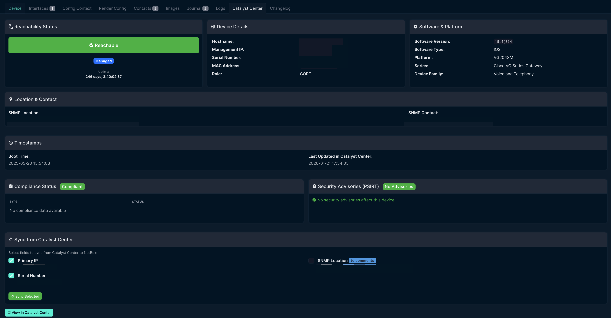
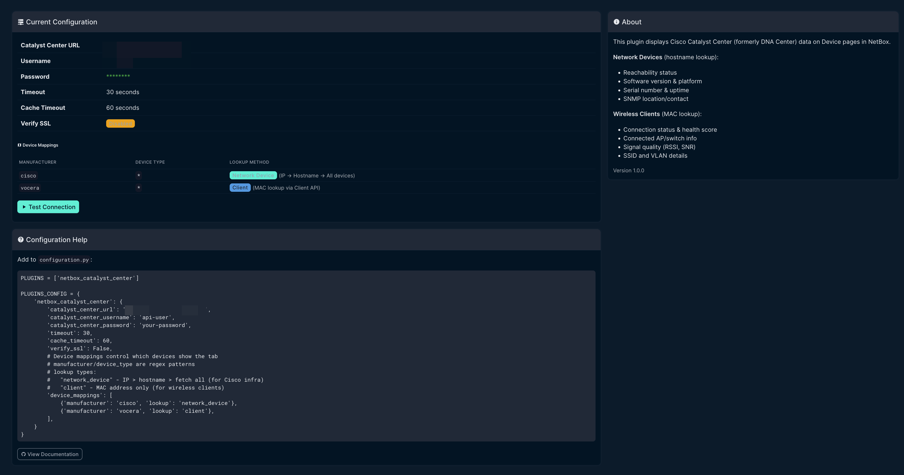

# NetBox Catalyst Center Plugin

A NetBox plugin that integrates Cisco Catalyst Center (formerly DNA Center) with NetBox, displaying network device details, wireless client information, compliance status, and security advisories.


[](https://opensource.org/licenses/Apache-2.0)
[](https://github.com/sieteunoseis/netbox-catalyst-center/actions/workflows/ci.yml)

## Features

### Network Device Integration
- **Device Details Tab**: Adds a "Catalyst Center" tab to Device detail pages
- **Reachability Status**: Shows device reachability and collection status
- **Software Information**: Displays software version, platform, and series
- **Compliance Status**: Shows PSIRT, IMAGE, CONFIG, and EOX compliance
- **Security Advisories**: Lists PSIRT advisories with links to Cisco security portal
- **Sync to NetBox**: Sync IP address, serial number, and SNMP location from Catalyst Center

### Wireless Client Support
- **Real-time IP Lookup**: Shows current IP address for wireless clients
- **Connection Status**: Displays connected/disconnected state with health score
- **AP Information**: Shows connected access point, SSID, and location
- **Signal Quality**: Displays RSSI, SNR, and data rate for wireless clients

### General Features
- **Configurable Device Mappings**: Control which devices show the tab and lookup method
- **Multi-strategy Lookup**: IP address → hostname → fetch all with local filtering
- **Caching**: Caches API responses to reduce load on Catalyst Center

## Screenshots

### Device Tab - Network Device View


### Settings Page


## Requirements

- NetBox 4.0 or higher
- Cisco Catalyst Center (DNA Center) 2.x or higher
- Python 3.10+

## Installation

### From PyPI (when published)

```bash
pip install netbox-catalyst-center
```

### From Source

```bash
git clone https://github.com/sieteunoseis/netbox-catalyst-center.git
cd netbox-catalyst-center
pip install -e .
```

### Docker Installation

Add to your NetBox Docker requirements file:

```bash
# requirements-extra.txt
netbox-catalyst-center
```

Or for development:

```bash
# In docker-compose.override.yml, mount the plugin:
volumes:
  - /path/to/netbox-catalyst-center:/opt/netbox/netbox/netbox_catalyst_center
```

## Configuration

Add the plugin to your NetBox configuration:

```python
# configuration.py or plugins.py

PLUGINS = [
    'netbox_catalyst_center',
]

PLUGINS_CONFIG = {
    'netbox_catalyst_center': {
        # Required: Catalyst Center URL
        'catalyst_center_url': 'https://dnac.example.com',

        # Required: API credentials
        'catalyst_center_username': 'api-user',
        'catalyst_center_password': 'your-password',

        # Optional settings with defaults:
        'timeout': 30,           # API timeout in seconds
        'cache_timeout': 60,     # Cache duration in seconds
        'verify_ssl': False,     # Verify SSL certificates

        # Device mappings: Control which devices show the tab
        # manufacturer/device_type are regex patterns matched against slug and name
        # lookup types:
        #   "network_device" - tries IP → hostname → fetch all (for Cisco infrastructure)
        #   "client" - MAC address only (for wireless clients like Vocera badges)
        'device_mappings': [
            # Cisco network devices (gateways, switches, APs)
            {'manufacturer': 'cisco', 'lookup': 'network_device'},
            # Vocera badges - lookup by MAC address
            {'manufacturer': 'vocera', 'lookup': 'client'},
        ],
    }
}
```

### Catalyst Center API User

Create an API user in Catalyst Center with these permissions:
- **Network Services** > **Read** - For client lookups
- **System** > **Read** - For device inventory

## Usage

Once installed and configured:

1. Navigate to any Device in NetBox
2. Click the **Catalyst Center** tab
3. View real-time client details from Catalyst Center

### Device Name as MAC Address

The plugin uses the **device name** as the MAC address for lookups. This works well for:
- Vocera badges (serial number = MAC address)
- Other wireless devices where name matches MAC

For devices where the name doesn't match the MAC, consider:
- Using a custom field for MAC address
- Naming devices with their MAC address

### What's Displayed

| Field | Description |
|-------|-------------|
| Connection Status | Connected/Disconnected with health score |
| IP Address | Current IPv4 address |
| MAC Address | Client MAC address |
| SSID | Connected wireless network |
| VLAN | Assigned VLAN ID |
| Connected AP | Access point name and interface |
| Location | Physical location from Catalyst Center |
| Signal Quality | RSSI, SNR, and data rate |

## Troubleshooting

### Client not found

- Verify the device name in NetBox matches the client MAC address in Catalyst Center
- Check that the client has connected to the network recently
- MAC format should be `xxxxxxxxxxxx` (no colons) or `xx:xx:xx:xx:xx:xx`

### Connection errors

- Verify `catalyst_center_url` is accessible from NetBox container
- Check that the API credentials are correct
- For self-signed certificates, set `verify_ssl: False`

### Authentication errors

- Verify the API user has required permissions
- Check that the password hasn't expired

## Development

### Setup

```bash
git clone https://github.com/sieteunoseis/netbox-catalyst-center.git
cd netbox-catalyst-center
pip install -e ".[dev]"
```

### Code Style

```bash
black netbox_catalyst_center/
flake8 netbox_catalyst_center/
```

## License

Apache License 2.0 - See [LICENSE](LICENSE) for details.

## Contributing

Contributions are welcome! Please:

1. Fork the repository
2. Create a feature branch
3. Submit a pull request

## Related Projects

- [netbox-graylog](https://github.com/sieteunoseis/netbox-graylog) - Display Graylog logs in NetBox
